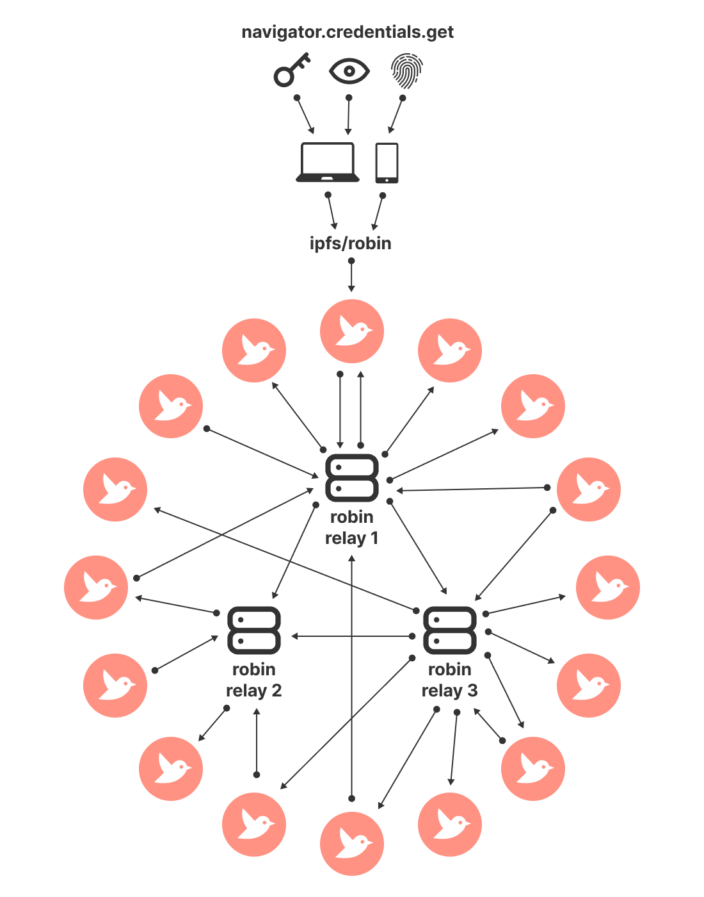

# Robin

What is Robin? Robin was [originally released](https://github.com/drewry/Robin/commit/fb150ce258b30f7ac635d0f0f3d876920771f9d6) in January 2012 during the [Arab Spring](https://en.wikipedia.org/wiki/Arab_Spring). Free speech was under threat and the need for a decentralized town square for humanity was clear. Now, 10 years later, there are additional concerns that this is once again under threat.

The inspiration for Robin comes from the concept of a _round robin_. Originally a round robin, or _le ruban rond_, was a practice used in 18th century France to sign protests against the King. Signatures were signed in a circle to hide who the organizer was. This gave people a voice, while reducing the fear of being shut down.

## Architecture

Robin uses a gossip-based consensus mechanism to broadcast messages in a decentralized network. The [gossip protocol (aka the epidemic protocol)](https://en.wikipedia.org/wiki/Gossip_protocol) is used to disseminated information about known state to the other members of a network. This means that there isn't a single point of failure and any node can participate freely.

The main components of the architecture are as follows:

- __User:__  which is verified with [WebAuthn](https://webauthn.io/) and generates a `publicKey`.
- __User Device:__  which can be either a smart phone or a computer navigating to a compatible browser.
- __Web App:__ which is a web application (HTML/CSS/JS) that can be hosted in [IPFS](https://ipfs.tech/).
- __Relay Server:__ which is a server implementing the gossip-protocol to relay state between nodes.

A `node` means the combined stack of a user, public key, user's device and instance of the web application running on the user's device. All communication between nodes are handled through network calls made from the node to the relay server. The relay server maintains a list of nodes it has recently communicated with via health checks. Upon each healthy response from a node, the relay server as the intermediator to send any requests/responses that have been made by other nodes.

Relay servers are also capable of communicating with other relay servers to reach consensus on gossip state. Nodes are not required to send the entire state each request but can use a truncated version of the most recent confirmed states. Messages are not validated until multiple nodes confirm and agree on the state. If consensus cannot be met, as there is disagreement about the most recent verified message, then nodes will revert back to the previously agreed state.

## Relay Incentives

Why run a relay server? Relay servers will be given the opportunity to show a promoted message every hundred or so messages relayed to a node. Relay servers are able to determine on their own how these promoted messages are selected, such as through an incentive program that they run.

## Voting, Moderation and Reputation

Voting is a critical aspect of this system, not simply as a general feature for sending out polls to followers, but also as a mechanism for moderation. If any message, including a promoted message, is deemed against the network's Code of Conduct, then a user can flag the message. This flag will then be sent as an event to other users where they will have the opportunity to agree with the flag or not. If consensus is met on the flag's validity, then the message will be hidden (or removed) from the network. The author of the message will also receive a penalty on their reputation score.

## Why not [Insert Alternative]?

This project has no aim of replacing [mastadon](https://joinmastodon.org/), [diaspora*](https://diasporafoundation.org/) or any other social network for that matter. In its current state, this project is simply an idea with the hopes of having a proof of concept in the short-term future. Much testing and scaling will be needed to verify if this is a viable alternative to any existing social network or online community.

Given the state of what is currently out there today, this project has a few design constraints:

- Ultra simplicity on both the usage of the app as well as joining the network
- Decentralization and individual ownership
- Looking towards the future and embracing technologies that are enabling while shedding technologies that add weight
- Introspection and the ability to implement major change when needed

## How can you help?

If any of this sounds interesting to you, please submit an Issue and/or a Pull Request with ideas, contributions, etc. There is no formal project plan or roadmap at this point.

## License

This project will be licensed as open-source, either MIT or Apache 2.0.
